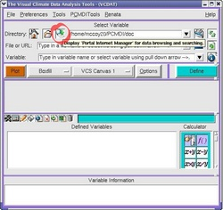
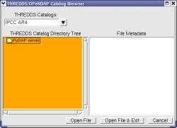
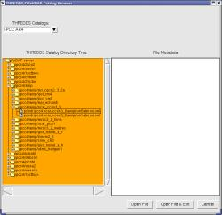
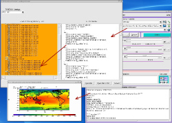

##Accessing IPCC data from VCDAT
###VCDAT OPeNDAP server access  

Goal:  To learn about OPeNDAP access from VCDAT. 

New CDAT v4.1 enables [OPeNDAP](http://www.opendap.org) interface to the  [IPCC](http://www.ipcc.ch) [ESG](https://esg.llnl.gov:8443/index.jsp) 
climate model simulations data holdings.&#160; The OPeNDAP server
enables to authenticate the user access, list files and subdirectories,
display metadata information, allow user to browse and download the chosen
data&#160; directly into the VCDAT for analysis.

[OPeNDAP](http://www.opendap.org//) is a software framework that allows access to remote scientific
datasets. The core of OPeNDAP is a specification of an http-based protocol
that describes how clients and servers should communicate data over the
network. There are a variety of clients and servers available that understand
DAP; an adaptation of the  [PyDAP](/) server is being used for the IPCC AR4
model output database.  

The server provides access to IPCC datasets. A  dataset  is an aggregation of
a set of related data files into a single virtual file. In general, a dataset
consists of all data variables for a given combination of model, scenario,
experimental&#160; run, temporal frequency, and&#160; submodel (ocean or atmosphere). A
dataset is represented by a  [CDMS XML](/../../cdat/manuals/cdms_v4.0_html/ch6_cdms_4.0.html) file.

Be aware that there is a definite overhead to accessing data through the
OPeNDAP server. Network speed, HTTP protocol, and server delays combine to
limit access speed in comparison to direct disk reads.  

You can access the IPCC AR4 data in a variety of ways:  
* from VCDAT 
* from CDMS 
* through &#160;the web browser 

To access the IPCC data  from VCDAT  click on the 'Portal Internet Manager' 
Button as shown in the image below (click on the image to see the bigger
picture)

  

This will open a new window with the data holdings directory. For your
convenience the IPCC AR4 data portal catalog has been selected. In the future,
more portal catalogs will be added.

Click on&#160;the '  PyDAP server  ' tab (  \+  ) to open it  

When you further click on the choosen model run, first you will be presented
with the password authentication window, and after entering the username and
password to the IPCC AR4 data holdings, you will see the metadata for the
choosen dataset appear in the right window.

Click on the '  Open File  ' or '  Open File and Exit  '  buttons at the
bottom of the window to import the data into the VCDAT. From there on, you can
select the variable in the VCDAT in the usual way and plot it.

To learn how to access the IPCC data  from CDMS module  and  from the web
browser  see [IPCC OPeNDAP Server](http://www-pcmdi.llnl.gov/software-portal/esg_data_portal/dapserver/) page.
