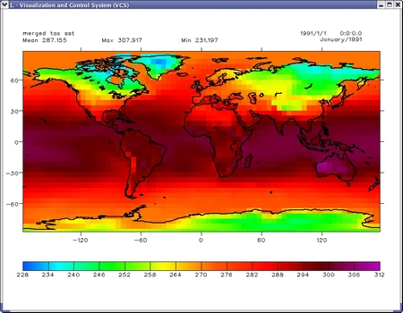
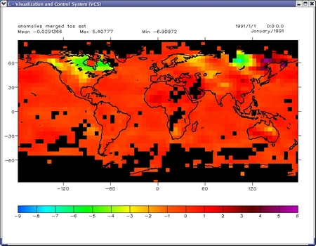
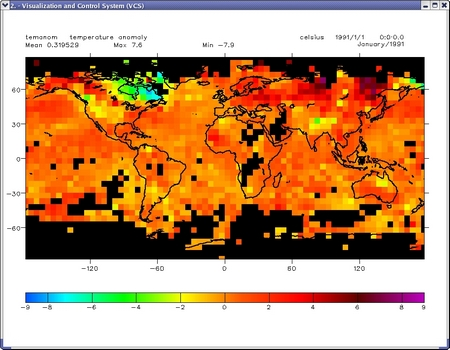

##  Part III. Annual Cycle Data and Anomaly
iGoal:  The goal for this tutorial is to show how to create annual cycle cdms data and easily calculate anual cycle anomaly, then plot it and write to a NetCDF file. 

The strategy:  

    5. merge masked sst&#160; with masked&#160; tas&#160; and create the cdms variable with the lat, lon, time definitions from 1)
    6. using&#160; cdutil&#160; create&#160; the annualcyle.climatology&#160; variable and calculate the anomalies  
    7. create the cdms variable with the anomalies field and lat, lon, time definitions from 1) , apply same as in 1) spatial missing mask , and write the resulting data to an output NetCDF file.  

####5) merge   masked 'sst' and 'tas' variables, create cdms variable 

Add masked sea ('sst') and land ('tas')&#160; data. So far they are defined as a numeric arrays.
We will create a cdms variable and add metadata to it. We will use lat, lon,
and time definitions from&#160; 1)&#160; (see [Part I](regridding.html) )
    
    # add land and ocean contributions for the merged product   
    merged=masked_sst+masked_tas  
    # add metadata to this numeric array  
      
    merged=cdms.createVariable(merged,axes=(tim,lat,lon),   
                 typecode='f',id='merged_tas_sst')   
    merged.id='merged_tas_sst'   
    merged.set_fill_value(1e20)    
    cdutil.setTimeBoundsMonthly(merged)  

Plot the merged data  

    x=clear()   
    x.plot(merged)   

  

Now create NetCDF output file with the name 'era40_merged_tas_sst.nc' and write the merged data.  
    
    # write out the total temperature data to a netcdf file   
    o=cdms.open('era40_merged_tas_sst.nc','w')  
    o.write(merged)  
    

####6)  create annual cycle data and calculate anomaly  

We want to match the data in 1) so we need to calculate annual cycle for the
time in the data 1) and subtract it from the data to calculate the anomaly.  
    
    # crete base period 1991-1993, inclusive   
    start_time = cdtime.comptime(1991,1,1)  
    end_time   = cdtime.comptime(1993,12,1)  

Define the annual cycle  

    # the annualcycle   
      
    ac=cdutil.ANNUALCYCLE.climatology( merged( time =    
            (start_time, end_time, 'co')))  
    # use the defined annual cycle and generate anomalies  
    merged_an=cdutil.ANNUALCYCLE.departures(merged,ref=ac) 

####7)  create cdms cariable, write to a NetCDF file  
    
    # add metadata to the new anomaly variable    
      
    merged_an=cdms.createVariable(merged_an,axes=(tim,lat,lon),  
              typecode='f',id='anomalies_merged_tas_sst')   
    merged_an.id='anomalies_merged_tas_sst'  
     # Lastly apply the "spatial missing mask" to these data   
    merged_an=MV.masked_where(MV.equal(mask1,1),merged_an)

plot the anomaly merged data

    y=clear()   
    y.plot(merged_an)  

  

Now write the data to the NetCDF file we have opened  
    
    o.write(merged_an)  
    o.close()

The final step is to compare our result with the annual cycle anomaly data
from CRU. Here is the plot we made in part I.

  

You can see that both plots are very symmilar, although you can see some small differences.
