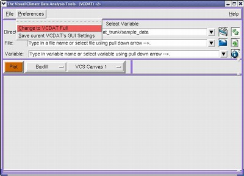
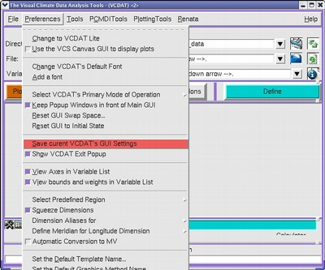
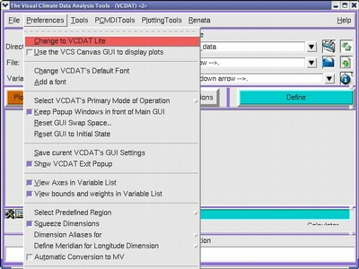
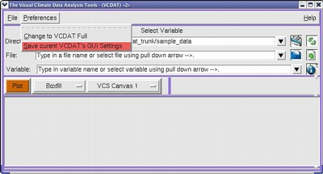

##  Changing Default VCDAT Look and Feel
Goal:  Be able to change the default look ad feel of the VCDAT. 

By default the VCDAT will open in the Lite Version.&#160; You can change this
behavior and make VCDAT full a default look and feel, so that every time you
open the VCDAT, it will come in a full version.

###   To switch the default from VCDAT Lite to VCDAT Full: 

1.  Switch to the VCDAT full version, by selecting 
  * "Preferences-->Change to VCDAT Full" 

2. In the full VCDAT mode window, select: 
  * "Preferences-->   Save current VCDAT's GUI Settings" 

###   To switch the default from VCDAT Full to VCDAT Lite: 

1.  Switch from the VCDAT full version to the Lite version, by selecting   
  * "Preferences-->Change to VCDAT Lite" 

2. In the lite VCDAT mode window, select: 
  *  "Preferences-->   Save current VCDAT's GUI Settings" 

