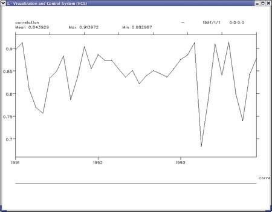

## Comparing Two Different Datasets
Goal:  The goal for this tutorial is to show how to compare two different datasets with different resolutions and how to use the statistical module.   

You can  download  and run the  python script [compare_datasets.py](media/images/python/compare_datasets.py)
or follow the tutorial and type commands at the  cdat  or  python prompt .  

We will work with the data from [ECMWF](http://www.ecmwf.int/) 
Re-Analysis [ERA40](http://www.ecmwf.int/research/era/) data and [ERA15](http://www.ecmwf.int/research/era/ERA-15/index.html) data.

The objective of this tutorial is to compare the two atmospheric-ocean climate model datasts: ERA15 model output and ERA40 model: output.  The data used in this tutorial is a sample of a real data.   

    
    # Import modules  
    import cdms, cdutil, MA, vcs, cdtime  
    import string, Numeric, time, MV, sys, os  
    from regrid import Regridder  
    from genutil import statistics

Lets open the ERA40 file and see what variables are inside
    
    file1 = os.path.join(sys.prefix, 'sample_data/era40_tas_sample.nc')  
    f1 = cdms.open( file1 )  
    f1.showvariable()

The output is:

    Variables in file /home/mccoy20/utils/cdat/sample_data/era40_tas_sample.nc:  
    ['bounds_latitude', 'bounds_time', 'bounds_longitude', 'tas']
  
List dimensions of the variables:
    
    f1.listdimension()  
    ['latitude', 'bound', 'longitude', 'time']

Look at the time axis to check what time range this data covers
    
    t = f1.getAxis('time')  
    print t  

    t  
    id: time  
    Designated a time axis.  
    units:  months since 1957-9-1 0:0  
    Length: 39  
    First:  400.0  
    Last:   435.0  
    Other axis attributes:  
    calendar: proleptic_gregorian  
    axis: T  
    Python id:  -0x491e2114  

Let's check what is the first and last time step, we will use componentTime()
function, so the time will appear in more usr friendl form  
    
    # print first time step in a user friendly time format  
    print  f1.getAxis('time').asComponentTime()[0]  
    
    1991-1-1 0:0:0.0  
    
    # print last [-1] time step in a user friendly time format  
    print  f1.getAxis('time').asComponentTime()[-1]

    1993-12-1 0:0:0.0

Now we will open second file and see what's inside  
    
    file2 = os.path.join(sys.prefix, 'sample_data/era15_tas_sample.nc')  
    f2 = cdms.open( file2 )  
    f2.showvariable()

The output is:

    Variables in file /home/mccoy20/utils/cdat/sample_data/era15_tas_sample.nc:  
    ['bounds_latitude', 'bounds_time', 'bounds_longitude', 'tas']  
  
List dimensions of the variables:
    
    f2.listdimension()

    ['latitude', 'bound', 'longitude', 'time']

Again, we will print the first and last time step  
    
    # print first time step in a user friendly time format  
    print  f2.getAxis('time').asComponentTime()[0]  
    
    1991-1-1 0:0:0.0  

    # print last [-1] time step in a user friendly time format  
    print  f2.getAxis('time').asComponentTime()[-1]

    1994-2-1 0:0:0.0

We want to extract data in overlapping time range, for example time range:
1991-1-1, to 1993-12-1  
    
    data1 = f1('tas', time = ('1991-1-1','1993-12-1'))  
    data2 = f2('tas', time = ('1991-1-1','1993-12-1'))  
    
Let's check the dimensions of the data:

    print data1.shape, data2.shape

    (36, 160, 320)   (36, 73, 144)

As we can see the data is on a different grids, let's get the grid of data1
and print it:

    grid1=data1.getGrid()  
    print grid1  

    Grid has Python id -0x491e2074.  
    Gridtype: generic  
    Grid shape: (160, 320)  
    Order: yx

Print the original ERA 40 data shape
    
    print 'original ERA40 data shape: ',data1.shape  

original ERA40 data shape:  (36, 160, 320)

Get the grid of data2 :  
    
    grid2 = data2.getGrid()  
    print grid2

    grid2  
    Grid has Python id -0x491e2454.  
    Gridtype: generic  
    Grid shape: (73, 144)  
    Order: yx

Define the regridder function to regrid grid1 from data1 to grid2, and print
new shape of data1

    regridfunc=Regridder(grid1,grid2)  
    data1=regridfunc(data1)  
    print 'new ERA40 data shape: ' ,data1.shape  

    new ERA40 data shape:  (36, 73, 144)

Set time bounds to monthly data, defile start_time and end_time
    
    cdutil.setTimeBoundsMonthly(data1)  
    cdutil.setTimeBoundsMonthly(data2)  
      
    start_time = cdtime.comptime(1991,1,1)  
    end_time   = cdtime.comptime(1993,12,1)  

Create annual cycle climatology data
    
    ac1=cdutil.ANNUALCYCLE.climatology(data1(time=(start_time, end_time, 'cob')))  
    ac2=cdutil.ANNUALCYCLE.climatology(data2(time=(start_time, end_time, 'cob')))  
    print ac1  

    array (12,73,144) , type = d, has 126144 elements  
  
Create data with departures of data1 from the reference ac1, and data2 from
ac2. Print the shapes of new datasetes
    
    data1=cdutil.ANNUALCYCLE.departures(data1,ref=ac1)  
    data2=cdutil.ANNUALCYCLE.departures(data2,ref=ac2)  
      
    print data1.shape,data2.shape  
    
    (36, 73, 144) (36, 73, 144)  

Get time dimention of the second datase
    
    tim = data2.getTime()  
    print tim  

    tim

    id: time  
    Designated a time axis.  
    units:  months since 1979-1-1 0:0  
    Length: 36  
    First:  144.0  
    Last:   179.0  
    Other axis attributes:  
    calendar: proleptic_gregorian  
    axis: T  
    Python id:  -0x491dc714

Get longitude and latitude from data2
    
    lat = data2.getLatitude()  
    lon = data2.getLongitude()

Create CDMS variable from data1
    
    data1=cdms.createVariable(data1,axes=[tim,lat,lon],typecode='f',id='tas')  

Calculate the difference and the zonal difference arrays between 2-meter
temperature
    
    diff=MV.subtract(data1,data2)  
    # zonal differences  
    z_diff=MV.average(diff,2)  
    print 'Zonal data shape (before): ',z_diff.shape  

Zonal data shape (before):  (36, 73)

We need to transpose the zonal difference data for eventual graphing...
    
    z_diff=MV.transpose(z_diff,(1,0))  

To create the CDMS variable we need to add attributes to the variable
    
    # add id to data  
    z_diff.id='zonal_diff'  
    print 'Zonal data shape (after): ',z_diff.shape  

    Zonal data shape (after):  (73, 36  )

Create global differences using averager from cdutil module
    
    # global differences  
    gl_diff=cdutil.averager(diff,axis='xy')

Let's plot an isofill of the zonal difference map. First we need to initialize
vsc, set standard colorpam and default isofill graphical object
    
    x=vcs.init()  
    x.setcolormap('default')  
    fill=x.getisofill('default')  
    x.plot(z_diff,fill)

here is the result

  
In the new window we can plot the global map differences as a timeplot
    
    x.clear()   
    x.plot(gl_diff)

  
No let's compute spatial and temporal correlation between these two time-
series as well as the temporal rms difference.
    
    cor_t=statistics.correlation(data1,data2,axis='xy')  
    # temporal correlation map betwen these to time-series  
    cor_m=statistics.correlation(data1,data2,axis='t')  
    # temporal rms difference between the two time series  
    rms=statistics.rms(data1,data2,axis='t')  

Lets plot the correlations and rms maps
    
    x.clear()    
    x.plot(cor_m,fill)

Plot temporal correlation
    
    x.clear()  
    x.plot(cor_t)

And the rms map
    
    x.clear()   
    x.plot(rms,fill)

We can compute the linear regression over time of each data. To write it to
the output NetCDF file, we need to add metadata. The calculated values have
preserved the latitude and longitude metadata however, the "id" needs to be
set.
    
    slope1, intercept1 = statistics.linearregression(data1, axis='t')  
    slope2, intercept2 = statistics.linearregression(data2, axis='t')  
    # set the 'id'  
    slope1.id='linear_slope'  
    slope2.id='linear_slope'

Let's define a decadal trend difference map (e.g., trends are defined from  
monthly data therefore multiply by 120 for a decade). And then plot it.
    
    dec_trnd_diff=(slope1*120.)-(slope2*120.)  
    dec_trnd_diff.id='decadal_trend_diff'  
       
    x.clear()  
    x.plot(dec_trnd_diff)  
    

Calculate variance and define set it's id.
    
    variance1=statistics.variance(data1)  
    variance2=statistics.variance(data2)  
    variance1.id='variance_data1'  
    variance2.id='variance_data2'   

Plot variance1
    
    x.clear()  
    x.plot(variance1,fill)  

Plot variance2
    
    x.clear()  
    x.plot(variance2,fill)  

  
Define variable 'f' being the 'variance1/variance2'
    
    f=variance1/variance2  
    f.id='variance_data1_dividedby_variance_data2'  

Finally write all the variable to the output NetCDF file of the name
'tas_comparison.nc' (~350kB).
    
    o=cdms.open('tas_comparison.nc','w')  
    o.write(f)  
    o.write(variance1)  
    o.write(variance2)  
    o.write(dec_trnd_diff)  
    o.write(rms)  
    o.write(z_diff)  
    o.close()  
      
    f1.close()  
    f2.close()  
    

This tutorial was provided by [Jay Hnilo](hnilo1@llnl.gov)
