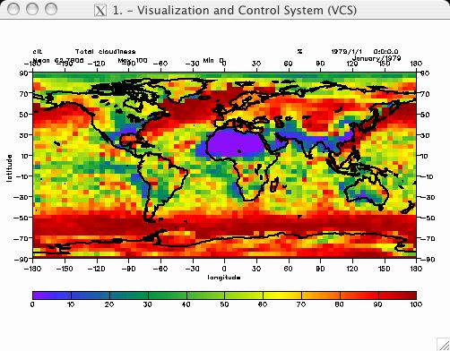
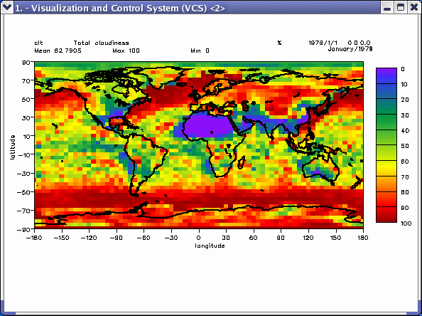

##  Creating and Modifying Templates
Goal:  Guide you through creating and setting template attributes.   

Before running the tutorial below, type _ "python" _ or _ "cdat" _ at the
command line. You will see the python prompt appear (i.e., ">>>"). You can
now enter the command lines below.  

You can [download](media/images/python/files/template_file.py) the full source code. To run the source
code at the command line, type: `python template.py`.
    
    Definition of a Template  
      
    Picture templates (known as just "templates") describe how to display all objects on the VCS Canvas.   
    More specifically, picture template attribute describe where segments of a picture will be displayed.   
    Segments are graphics representations of: textual identification of the data; formatted values of single-valued   
    dimensions and mean, maximum, and minimum data values; axes tick marks and labels; boxes and lines; a legend   
    that is graphics method specific; and the data.   
    
    # Import the modules needed for the tuturial  
    # cdms - Climate Data Management system accesses gridded data.  
    # vcs - Visualization and control System 1D and 2D plotting routines.  
    # cdutil - Climate utilitizes that contains miscellaneous routines for   
    #          manipulating variables.  
    # time - This module provides various functions to mainpulate time values.  
    # os - Operation System routines for Mac, DOS, NT, or Posix depending on   
    #      the system you're on.  
    # sys - This module provides access to some objects used or maintained by   
    #       the interpreter and to functions that interact strongly with the interpreter.  
    import vcs, cdms, cdutil, time, os, sys  
      
    # Open data file:  
    filepath = os.path.join(sys.prefix, 'sample_data/clt.nc')  
    cdmsfile = cdms.open( filepath )  
      
    # Extract a 3 dimensional data set and get a subset of the time dimension  
    data = cdmsfile('clt', longitude=(-180, 180), latitude = (-90., 90.))  
      
    # Initial VCS:  
    v = vcs.init()

The VCS module contains a list of persistent template objects. To view this list issue the "show" command.  
    
    # Show the list of persistent templates.  
    v.show('template')  
    
    *Template Names List*  
    (   1):                 ASD                ASD1               ASD10
    (   4):               ASD11               ASD12               ASD13
    (   7):               ASD14               ASD15           ASD1_of_2
    (  10):       ASD1_of_2_dud           ASD1_of_3       ASD1_of_3_dud
    (  13):           ASD1_of_4       ASD1_of_4_dud                ASD2
    (  16):           ASD2_of_2       ASD2_of_2_dud           ASD2_of_3
    (  19):       ASD2_of_3_dud           ASD2_of_4       ASD2_of_4_dud
    (  22):                ASD3           ASD3_of_3       ASD3_of_3_dud
    (  25):           ASD3_of_4       ASD3_of_4_dud                ASD4
    (  28):           ASD4_of_4       ASD4_of_4_dud                ASD5
    (  31):                ASD6                ASD7                ASD8
    (  34):                ASD9             ASD_dud             ASD_map
    (  37):         ASD_map1of2     ASD_map1of2_dud         ASD_map1of3
    (  40):     ASD_map1of3_dud         ASD_map1of4     ASD_map1of4_dud
    (  43):         ASD_map2of2     ASD_map2of2_dud         ASD_map2of3
    (  46):     ASD_map2of3_dud         ASD_map2of4     ASD_map2of4_dud
    (  49):         ASD_map3of3     ASD_map3of3_dud         ASD_map3of4
    (  52):     ASD_map3of4_dud         ASD_map4of4     ASD_map4of4_dud
    (  55):      BL_of6_1legend               BLof6      BR_of6_1legend
    (  58):               BRof6               LLof4           LLof4_dud
    (  61):               LRof4           LRof4_dud              ML_of6
    (  64):      ML_of6_1legend              MR_of6      MR_of6_1legend
    (  67):      UL_of6_1legend               ULof4           ULof4_dud
    (  70):               ULof6              UR_of6      UR_of6_1legend
    (  73):               URof4           URof4_dud        bold_bot_of3
    (  76):        bold_mid_of3        bold_top_of3       boldbot_of3_l
    (  79):       boldmid_of3_l       boldtop_of3_l             bot_of2
    (  82):             default         default_dud           hovmuller
    (  85):          mollweide2           no_legend          por_botof3
    (  88):      por_botof3_dud          por_midof3      por_midof3_dud
    (  91):          por_topof3      por_topof3_dud               quick
    (  94):             top_of2
    *End Template Names List*
    
    # Assign the variable "t_asd" to the persistent 'ASD' template.  
    t_asd = v.gettemplate( 'ASD' )  
      
    # Create a new template from the existing 'ASD' template  
    t2_asd = v.createtemplate( 'new', 'ASD' )  
      
    # Plot the data using the above 'ASD' template.  
    v.plot( data, t_asd )

  
    
    #############################################################################  
    # Show the many different ways to show the template members (attributes)  
    # and their values.  
    ##############################################################################  
    t_asd.list()                    # list the templates members  
    t_asd.list('text')              # list only text members, same as t_asd.list('Pt')  
    t_asd.list('format')            # list only format members, same as t_asd.list('Pf')  
    t_asd.list('xtickmarks')        # list only xtickmarks members, same as t_asd.list('Pxt')  
    t_asd.list('ytickmarks')        # list only ytickmarks members, same as t_asd.list('Pyt')  
    t_asd.list('xlabels')           # list only xlabels members, same as t_asd.list('Pxl')  
    t_asd.list('ylabels')           # list only ylabels members, same as t_asd.list('Pyl')  
    t_asd.list('boxeslines')        # list only boxeslines members, same as t_asd.list('Pbl')  
    t_asd.list('legend')            # list only legend member, same as t_asd.list('Pls')  
    t_asd.list('data')              # list only data member, same as t_asd.list('Pds')  
    t_asd.list('file')              # list only file member and its values  
    t_asd.file.list()               # list only file member and its values  
    t_asd.list('mean')              # list only mean member and its values  
    t_asd.mean.list()               # list only mean member and its values  
    
    # Remove picture segments from the page.  
    t_asd.list( )  
    t_asd.xlabel2.priority = 0  
    t_asd.xtic2.priority = 0  
    t_asd.xtic2.priority = 0  
    t_asd.legend.priority=0  
      
    # save current 'Mean' placemant for x and y coordinates  
    xmean_current = t_asd.mean.x  
    ymean_current = t_asd.mean.y  
      
    # now change the placement  
    t_asd.mean.x=0.5       # move the "Mean" text to x-axis center  
    t_asd.mean.y=0.5       # move the "Mean" text to y-axis center  
      
    t_asd.data.priority = 0 # remove the data so the "Mean" text is visable.  
    v.update()  
      
    #############################################################################  
    # Place the colorbar legend vertically and to the right side.  
    #############################################################################  
    t_asd.data.priority = 1  
    t_asd.legend.priority = 1  
    t_asd.legend.list()         # list the legend members  
    v.mode=0                    # turn the automatic update off  
      
      
    # move 'Mean' text back where it was  
    t_asd.mean.x = xmean_current  
    t_asd.mean.y = ymean_current  
      
    # move the right side of a plot to the left to make space for the legend  
    # first move the inner plot  
    t_asd.data.x2 = 0.87  
    # then move the sorrounding box - the right y-axis  
    t_asd.box1.x2 = 0.87  
      
    # set the top x-axis (secind y axis) to be blank  
    t_asd.xlabel2.priority = 0  
    t_asd.xtic2.priority = 0  
    # set the right y-axis (second y axis) to be blank (priority=0)  
    t_asd.ylabel2.priority = 0  
    t_asd.ytic2.priority = 0  
      
    # move the colorbar legend position, to be vertial and to the right  
    t_asd.legend.x1=0.9  
    t_asd.legend.y1=0.82  
    t_asd.legend.x2=0.95  
    t_asd.legend.y2=0.3  
      
    # clear the canvas and plot the template again  
    v.clear()  
    v.plot( data, t_asd )  
    
  
