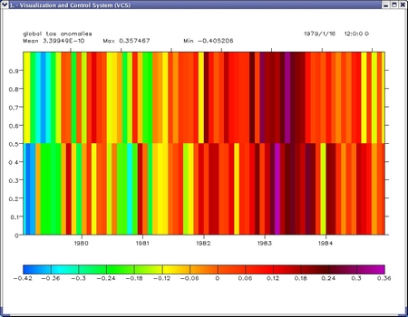
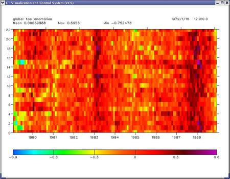

#  Global Anomalies

Goal:  The goal for this tutorial is to show how to extract several AMIP model data, generate global anomalies data and save it to a NetCDF file, andcreate a global anomalies plot. 

We will learn how to loop through a subset of the 
[AMIP](http://helene.llnl.gov/projects/amip/index.php) data and extract the specified
variable, calculate annual cycle and gridpoint anomalies and generate a global
anomaly time series plot and output NetCDF file with this anomaly time series
data.

You can download the python script file [global_anomalies.py](media/images/python/global_anomalies_new.py).

Note:  We will work with two smaller subsets of model data. We assume
to have the data from CCSR/NIES AGCM model (tas_ccsr-95a_*.nc), and another
model data from DNM model (tas_dnm-95a_*.nc).To use those files as dataset we
can create the xml description file by runnindg at a shell prompt:  
 cdscan -x tas_ccsr-95a.xml  tas_ccsr-95a*.nc    
and separate for the second dataset:  
 cdscan -x tas_dnm-95a.xml tas_dnm-95a*.nc    
We will use the *.xml files that are created for you in the sample data
directory of your cdat installation. 
  
First let's import all the needed modules
    
    import cdms, cdutil, MA, vcs, cdtime  
    import string, Numeric, time, sys, os

define the variable name we are going to extract from the data
    
    var='tas' 

define the models for which we will extract the data
    
    model=[ 'ccsr-95a', 'dnm-95a' ]

set up a description string for addition to the global attributes in the
output netcdf
    
    model_description=''

Loop over all models, open the appropriate model's data with surface
temperature, variable name 'tas', check and print the model and the data's
shape, and compose the model_description string with the names of all the
models:
    
    for i in range(0,len(model)):  
       file_xml = os.path.join(sys.prefix,'sample_data/'  
                      +var+'_'+model[i]+'.xml')  
     a = cdms.open(file_xml)  
     data = a[var]  
       a.close()  
     print i, model[i], data.shape  
       start_time = data.getTime().asComponentTime()[0]  
       end_time = data.getTime().asComponentTime()[-1]  
       print 'start time: ',start_time,'  end time:',end_time  
       time_len = len(data.getTime())  
       print 'time axis lenght: ', time_len   
     dm = str(i) + ' = ' + model[i]  
     model_description = model_description + ', ' + dm

You'll see the output as follows:  

    \---- 0 ccsr-95a (72, 1, 32, 64)  
    start time: 1979-1-16 12:0:0.0 end time: 1984-12-16 12:0:0.0  
    time axis lenght: 72  
    \---- 1 dnm-95a (72, 1, 45, 72)  
    start time: 1979-1-16 12:0:0.0 end time: 1984-12-16 12:0:0.0  
    time axis lenght: 72  

Now let's set up an output array for the global time series
    
    glan=MA.zeros([len(model),time_len],MA.Float) 

Loop over the files and read data into memory. Subtract the average annual
cycle and are-average the departure maps for a global departure/anomaly time
series.  
 Notice the last command - the average is over axis = 'xy', this is
equivalet to writing axis='21' (which means average over the dimensions in
the 2nd position then over the 1st position starting from 0). The 0th position
is time, the 1st is latitude and 2nd - longitude. The data_an axes are
('t','y','x'). In the averager you could also use axis = '(lon)(lat)'.  
    
    for i in range(0,len(model)):  
       file_xml = os.path.join(sys.prefix,'sample_data/'  
                      +var+'_'+model[i]+'.xml')  
     a = cdms.open(file_xml)   
       data=a(var,time=(start_time,end_time),squeeze=1)  
       a.close()  
       ac=cdutil.ANNUALCYCLE.climatology(data(time=(start_time, end_time, 'cob'  
       data_an=cdutil.ANNUALCYCLE.departures(data,ref=ac)  
       print i,model[i],data.shape, data_an.shape  
       glan[i,:]=cdutil.averager(data_an,axis='xy')

The output will look like that:  
  
0 ccsr-95a (72, 32, 64) (72, 32, 64)  
1 dnm-95a (72, 45, 72) (72, 45, 72)  

setup metadata and write out to a netcdf file
    
    tim = data.getTime()  
    runs = Numeric.arange(0,len(model))  
    runs = cdms.createAxis(runs,id='models')  
    glan = cdms.createVariable(glan,axes=(runs,tim),id='global_'+var+'_anomalies') 

open the NetCDF output file (in your current directory) and write the data
('global_anomalies.nc'~26kB)
    
    q = cdms.open('global_anomalies.nc','w')  
    q.model_designation = model_description  
    q.write(glan)  
    q.close()   

Make a simple time series plot of a global anomaly

    x = vcs.init()  
    x.setcolormap('default')  
    x.plot(glan)

Here is the final plot of global surface air temerature (tas) anomalies  

  

And for the comparison, here is how the plot would look like if we would work
with the 22 models from the AMIP repository at'pcmdi/AMIP3/amip/mo/'  

  
  
This tutorial wasprovided by [Jay Hnilo](hnilo1@llnl.gov)
