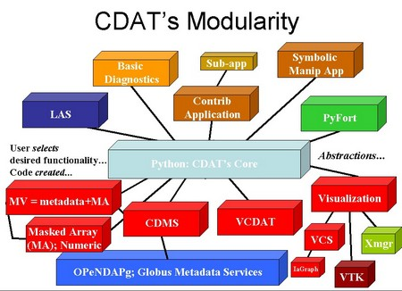

###CDAT is deprecated and is now part of [ UV-CDAT ](/)

[CDAT](/cdat_intro.html) makes use of an open-source, object-oriented,
easy-to-learn scripting language (Python) to link together separate software subsystems
and packages to form an integrated environment for data analysis. 
Outside collaborators work independently and contribute on an equal
basis with PCMDI.

CDAT's&#160; major subsystems are:

* [cdms](/manuals/cdms_v4.0_html/ch1_cdms_4.0.html/) \- Climate Data Management System (file I/O,&#160; variables, types, metadata, grids)
* [cdutil](/manuals/cdutil/cdat_utilities.html) \- Climate Data Specific Utilities (spatial and temporal averages, custom seasons, climatologies)
* [genutil](/manuals/cdutil/cdat_utilities-2.html) \- General Utilities (statistical and other convenience functions)
* [numPy ](/) \- Numerical Python _ (large-array numerical operations)
* [vcs](/software/cdat/support/vcs/vcs.html) \- Visualization and Control System (manages graphical window: picture template, graphical methods, data)

[VCDAT](/tutorials/getting-started/what-is-vcdat) is the graphical
user interface for CDAT and helps users become familiar with CDAT by
translating every button press and keystroke into Python scripts. VCDAT does
not require learning Python and the CDAT software.

CDAT is public domain software with unrestricted use. For details, see the [license](/docs/cdat-license).
