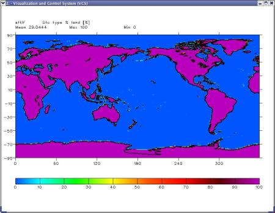
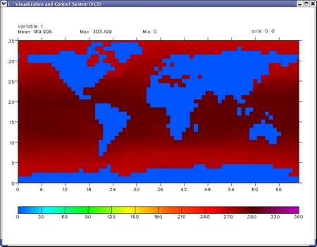
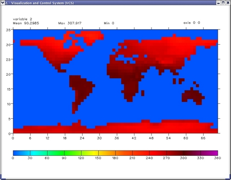

##  Part II. Masking Technique
Goal:  The goal for this tutorial is to show how to create sea/land mask and apply those masks to sea/land data creating masked data.   

The strategy:  

3) read the data with fraction land caverage from which the land/sea mask
will be created. Regrid the fraction to the 5-deg grid, create land and sea
masks.  

4) create sst/tas variables masked with ocean/land maskes .  

3) read the data with fraction land caverage _   

    # extract a land/sea mask and regrid it to our desired 5 degree grid  
    # (these data are percent land coverage [0-100])  
    file4 = os.path.join(sys.prefix, 'sample_data/geo.1deg.ctl')  
    c = cdms.open(file4)   
    fraction=c('sftlf',squeeze=1)  
    c.close()   
    # plot the fraction field  
    y=vcs.init()  
    y.setcolormap('default')  
    y.plot(fraction)

  
  
Regrid the fraction to the 5-deg grid, create land and sea masks.  
    
    # get grid for regridding   
    grid3=fraction.getGrid()   
    # etup regrid function   
    regridfunc=Regridder(grid3,grid1)  
    # regrid mask values   
    fraction=regridfunc(fraction)   
        
    # create land and sea masks.  
    # 50% or more coverage in a box is defined as land   
    # and less than or equal to 50% coverage is ocean.  
    # All other values in the arrays are zeros.  
    land=Numeric.where(Numeric.greater(fraction.filled(),50.),1.,0.)  
    ocean=Numeric.where(Numeric.less_equal(fraction.filled(),50.),1.,0)

_  4)  create sst/tas variables masked with ocean/land maskes . _  
    
    masked_sst=Numeric.multiply(sst_new.filled(),ocean)  
    masked_tas=Numeric.multiply(tas_new.filled(),land)

Plot 'masked_sst' and 'masked_tas'  
    
    x=clear()   
    x.plot(masked_sst) 

  
    
    y=clear()   
    y.plot(masked_tas)

  
