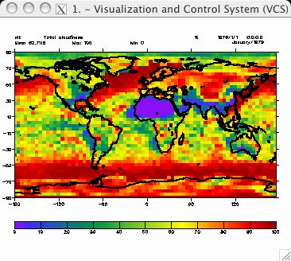
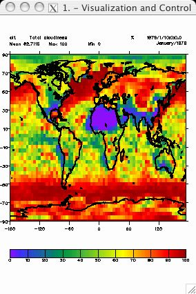

#  Page Orientation and Output
Goal:  Setting the VCS Canvas page orientation and generating output files.   
  

Before running the tutorial below, type _ "python" _ or _ "cdat" _ at the
command line. You will see the python prompt appear (i.e., ">>>"). You can
now enter the command lines below.  
  
You can [download](media/python/orientation_and_output.py) the full source code.
To run the source code at the command line, type: `python orientation_and_output.py`/
    
    # Import the modules needed for the tuturial  
    # cdms - Climate Data Management system accesses gridded data.  
    # vcs - Visualization and control System 1D and 2D plotting routines.  
    # cdutil - Climate utilitizes that contains miscellaneous routines for   
    #          manipulating variables.  
    # time - This module provides various functions to mainpulate time values.  
    # os - Operation System routines for Mac, DOS, NT, or Posix depending on   
    #      the system you're on.  
    # sys - This module provides access to some objects used or maintained by   
    #       the interpreter and to functions that interact strongly with the interpreter.  
    import vcs, cdms, cdutil, time, os, sys  
      
    # Open data file:  
    filepath = os.path.join(sys.prefix, 'sample_data/clt.nc')  
    cdmsfile = cdms.open( filepath )  
      
    # Extract a 3 dimensional data set  
    data = cdmsfile('clt')  
      
    # Initial VCS:  
    v = vcs.init()  
      
    # Opening a VCS Canvas - not necessary to do this   
    # before issuing the plot command!  
    v.open()  
      
    # A quick plot of the data  
    v.plot( data )  

   

    # Changing plot orientation to "Portrait"   
    v.portrait()

    
    # To change the orientation back to "Landscape"  
    v.landscape()

  

    
    ##############################################################  
    #                                                            #  
    # Saving "Landscape" orientation graphics to file            #  
    # "Landscape" is the default output orientation.             #  
    #                                                            #  
    ##############################################################  
      
    # Append to a postscript file  
    v.postscript('test.ps')  
      
    # Overwrite the existing postscript file  
    v.postscript('test.ps')  
      
    # GIF format - append landscape orientation gif image   
    v.gif('test.gif', merge='a', orientation='l', geometry='800x600')  
      
    # CGM format - append to an existing cgm file  
    v.cgm('test.cgm', 'a')  
      
    # Encapsulated Postscript - overwrite an existing eps file  
    v.eps('test.eps', 'r')  
      
    # PDF format  
    v.pdf('test.pdf')  
      
    ###########################################################################  
    # GhostScript (gs) format -                                               #  
    # This routine allows the user to save the VCS canvas in one of the many  #  
    # GhostScript (gs) file types (also known as devices). To view other      #  
    # GhostScript devices, issue the command "gs --help" at the terminal      #   
    # prompt.                                                                 #  
    ###########################################################################  
    v.gs('example')  # defaults: device='png256', orientation='l' and resolution='792x612'  
    v.gs(filename='example.tif', device='tiffpack', orientation='l', resolution='800x600')  
    v.gs(filename='example.pdf', device='pdfwrite', orientation='l', resolution='200x200')  
    
    # Changing plot orientation to "Portrait"   
    v.portrait()

    
    
    ##############################################################  
    #                                                            #  
    # Saving "Portrait" orientation graphics to file            #  
    #                                                            #  
    ##############################################################  
      
    # Append postscript output to an existing file  
    v.postscript('test.ps','a','p')  
      
    # Overwrite existing postscript file with a new postscript file  
    v.postscript('test.ps','r','p')  
      
    # GIF format - overwrite gif image(s) output with portriat gif image  
    v.gif('test.gif', merge='r', orientation='p', geometry='800x600')  
      
    # CGM format - overwrite existing cgm file  
    v.cgm('test.cgm', 'r')  
      
    # Encapsulated Postscript - append portait output to an existing eps file.  
    v.eps('test.eps', 'a', 'p')  
      
    # PDF format  
    v.pdf ('test.pdf', 'p')  
      
    ###########################################################################  
    # GhostScript (gs) format -                                               #  
    # This routine allows the user to save the VCS canvas in one of the many  #  
    # GhostScript (gs) file types (also known as devices). To view other      #  
    # GhostScript devices, issue the command "gs --help" at the terminal      #   
    # prompt.                                                                 #  
    ###########################################################################  
    
    v.gs(filename='example.jpg', device='jpeg', orientation='p', resolution='1000x1000')  
