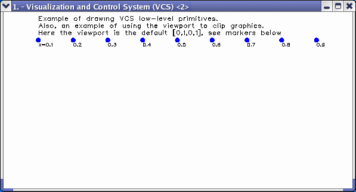
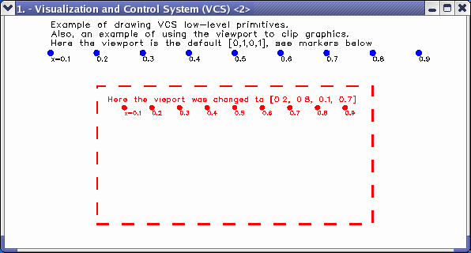
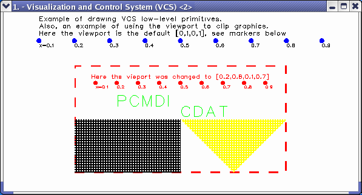

##  Plotting Primitives
Goal:  Guide you through plotting using graphics primitives.   

Before running the tutorial below, type _ "python" _ or _ "cdat" _ at the
command line. You will see the python prompt appear (i.e., ">>>"). You can
now enter the command lines below.  

You can [download](media/python/primitive_file.py) the full source code. To run the source
code at the command line, type: `python primitive_file.py`.:
    
    # Import the modules needed for the tuturial  
    # vcs - Visualization and control System 1D and 2D plotting routines.  
    import vcs  
      
    # Initial VCS:  
    v = vcs.init()

There are four drawing primitives:

1. Text 
2. Lines 
3. Markers 
4. Fillareas 

All graphics primitives have a viewport and world coordinate associated with
them. If the graphics primitive's viewport and world coordinate values are not
set, the global v.viewport() (e.g., [0,1,0,1]) and v.world() (e.g., [0,1,0,1]
coodinate values will be used.

    # Import the modules needed for the tuturial  
    import vcs, sys  
      
    # Initial VCS:  
    v = vcs.init()  
      
    # Create and draw a "Text" on the VCS Canvas.  
    tex = v.createtext('nTtex','std','nToex','7left')  
    tex.height = 20  
    tex.x=[0.1, 0.1, 0.1]  
    tex.y=[0.97, 0.93, 0.89]  
    tex.string=['Example of drawing VCS low-level primitives.',  
      'Also, an example of using the viewport to clip graphics.',  
      'Here the viewport is the default [0,1,0,1], see markers below']  
    v.plot(tex)  
      
    print ""  
    print "Press the Return key to see the next set of primitives."  
    sys.stdin.readline()  
      
    # create marker in a shape of a dot to mark where the x coordinates   
    # of this viewport are  
    mk=v.createmarker('new')  
    mk.x=[0.1,0.2,0.3,0.4,0.5,0.6,0.7,0.8,0.9]  
    mk.y=[0.84,0.84,0.84,0.84,0.84,0.84,0.84,0.84,0.84]  
    mk.color=244  
    mk.size=7  
    mk.type='dot'  
    v.plot(mk)  
      
    # create ne text object, with default settings  
    # this text object will annotate the markers  
    t1 = v.createtext('new1')  
    t1.x=[0.1,0.2,0.3,0.4,0.5,0.6,0.7,0.8,0.9]  
    t1.y=[0.82,0.82,0.82,0.82,0.82,0.82,0.82,0.82,0.82]  
    t1.string=['x=0.1','0.2','0.3','0.4','0.5','0.6','0.7','0.8','0.9']  
    t1.height = 15  
    v.plot(t1)

    # Let the world coordinate values remain the default  
    # setting (i.e.,[0, 1, 0, 1]), but change the global viewport.  
    v.viewport=[0.3,0.7,0.3,0.7]  
      
    # Create the line, fill area, and text objects  
    ln=v.createline('new')  
    fa=v.createfillarea('new')  
    t=v.createtext('newTt','std','newTo','7left')  
      
    # Draw a box around the entire VCS Canvas viewport. It will   
    # use the global viewport setting above and use the default  
    # world coordinate values.  
    # Remember the default values for vp and wc are:  
    #            viewport         = [0.0, 1.0, 0.0, 1.0]  
    #            worldcoordinate  = [0.0, 1.0, 0.0, 1.0]  
    ln.x=[0, 1, 1, 0, 0]            # x line positions  
    ln.y=[0, 0, 1, 1, 0]            # y line positions  
    ln.width=4                      # test width  
    ln.color = 242                  # test color  
    ln.type = 4                     # test line type  
    v.plot(ln)                      # plot lines  
    print "Press the Return key to see the next set of primitives."  
    sys.stdin.readline()  
      
    # create another text object for the new vieport title  
    t3 = v.createtext('new3')  
    t3.x=[0.08]  
    t3.y=[0.91]  
    t3.color = 242  
    t3.string=['Here the vieport was changed to [0.2, 0.8, 0.1, 0.7]']  
    t3.height = 18  
    v.plot(t3)  
      
    # create another marker object, similar to previous one,  
    # place at the same coordinates   
    # notice where those x coordinates are in the new viewport  
    mk1=v.createmarker('new1')  
    mk1.x=[0.1,0.2,0.3,0.4,0.5,0.6,0.7,0.8,0.9]  
    mk1.y=[0.84,0.84,0.84,0.84,0.84,0.84,0.84,0.84,0.84]  
    mk1.color=242  
    mk1.size=6  
    mk1.type='dot'  
    v.plot(mk1)  
      
    # create new text object to annotate above markers  
    t2 = v.createtext('new2')  
    t2.x=[0.1,0.2,0.3,0.4,0.5,0.6,0.7,0.8,0.9]  
    t2.y=[0.81,0.81,0.81,0.81,0.81,0.81,0.81,0.81,0.81]  
    t2.string=['x=0.1','0.2','0.3','0.4','0.5','0.6','0.7','0.8','0.9']  
    t2.height = 13  
    t2.color = 242  
    v.plot(t2)

  

    
    # Draw text on the screen. Use global vp and default wc.  
    t.x = [0.2, 0.5]               # x text positions  
    t.y = [0.7, 0.6]                # y text positions  
    t.string=['PCMDI', 'CDAT']      # text strings  
    t.color=243                     # text color  
    t.height = 50                   # text size  
    v.plot(t)                       # plot text  
    print "Press the Return key to see the next set of primitives."  
    sys.stdin.readline()  
      
    # Draw fill area on screen. Use global vp and default wc.  
    fa.x=[[0.0,0.5,0.5,0.0],[0.5,1.0,0.75] ]# x fill area positions  
    fa.y=[[0.0,0.0,0.5,0.5],[0.5,0.5,0.0] ]# x fill area positions  
      
    fa.color=[241,245]      # fill area color  
    fa.style='hatch'        # fill area style  
    fa.index=3              # fill area index  
    v.plot(fa)              # plot fill area   
    print "Press the Return key to end."  
    sys.stdin.readline()  
    

