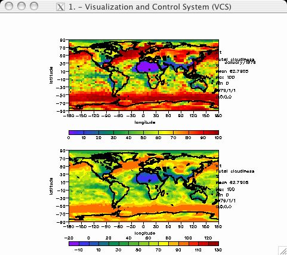

##  Save Plot to an Output File

Goal:  Guide you through saving a plot in various graphics file formats.   

Before running the tutorial below, type _ "python" _ or _ "cdat" _ at the
command line. You will see the python prompt appear (i.e., ">>>"). You can
now enter the command lines below.  
  
You can [download](media/python/output_file.py) the full source code. To run the source code
at the command line, type: `python output_file.py`.

    
    # Import the modules needed for the tuturial  
    # cdms - Climate Data Management system accesses gridded data.  
    # vcs - Visualization and control System 1D and 2D plotting routines.  
    # cdutil - Climate utilitizes that contains miscellaneous routines for   
    #          manipulating variables.  
    # time - This module provides various functions to mainpulate time values.  
    # os - Operation System routines for Mac, DOS, NT, or Posix depending on   
    #      the system you're on.  
    # sys - This module provides access to some objects used or maintained by   
    #       the interpreter and to functions that interact strongly with the interpreter.  
    import vcs, cdms, cdutil, time, os, sys  
      
    # Open data file:  
    filepath = os.path.join(sys.prefix, 'sample_data/clt.nc')  
    cdmsfile = cdms.open( filepath )  
      
    # Extract a 3 dimensional data set and get a subset of the time dimension  
    data = cdmsfile('clt', longitude=(-180, 180), latitude = (-90., 90.))  
      
    # Initial VCS:  
    v = vcs.init()

Get a boxfill and isofill graphics method objects and the template objecs and
plot:  

    # Assign the variable "bf_asd" to the persistent 'ASD' boxfill graphics methods.  
    bf_asd = v.getboxfill( 'ASD' )  
      
    # Assign the variable "cf_asd" to the persistent 'ASD' isofill graphics methods.  
    cf_asd = v.getisofill( 'ASD' )  
      
    # Assign the variables "bf_asd1" and "bf_asd2" to the persistent   
    # boxfill graphics methods.  
    tplt_asd1 = v.gettemplate( 'ASD1_of_2' )  
    tplt_asd2 = v.gettemplate( 'ASD2_of_2' )  
      
    # Plot the data using the above graphics methods and templates.  
    # Plot the data in background mode using the "bg=1" option.  
    # In this example two plot will be plotted on the VCS Canvas.  
    v.plot( data, bf_asd, tplt_asd1, bg=1 )  
    v.plot( data, cf_asd, tplt_asd2, bg=1 )  

Generate a postscript output file.  

    v.postscript('test.ps')  

Generate a gif output file.  
    
    v.gif('test.gif')

Generate a cgm output file.  
    
    v.cgm('test.cgm')

Generate a raster output file.  
    
    v.raster('test.ras')

Generate a ghostscript output file.  

    
    This routine allows the user to save the VCS canvas in one of the many GhostScript (gs) file types (also known as devices). To view other GhostScript devices, issue the command "gs --help" at the terminal prompt. Device names include: bmp256, epswrite, jpeg, jpeggray, pdfwrite, png256, png16m, sgirgb, tiffpack, and tifflzw. By default the device = 'png256'.  
      
    If no path/file name is given and no previously created gs file has been designated, then file  
      
     /$HOME/PCMDI_GRAPHICS/default.gs  
      
    will be used for storing gs images. However, if a previously created gs file exist, then this output file will be used for storage.  
      
    By default, the page orientation is in Landscape mode (l). To translate the page orientation to portrait mode (p), set the parameter orientation = 'p'.  
      
    The gs command is used to create a single gs file at this point. The user can use other tools to append separate image files.  
      
    Example of Use:  
     a=vcs.init()  
     a.plot(array)  
     a.gs('example') #defaults: device='png256', orientation='l' and resolution='792x612'  
     a.gs(filename='example.tif', device='tiffpack', orientation='l', resolution='800x600')  
     a.gs(filename='example.pdf', device='pdfwrite', orientation='l', resolution='200x200')  
     a.gs(filename='example.jpg', device='jpeg', orientation='p', resolution='1000x1000')

    # generate ghostscript png output file  
    x.gs('test.png')  
      
    # generate ghostscript tiff output file  
    x.gs('test.tif', device = 'tiff24nc', orientation = 'l', resolution = '172.x172.')  

  
