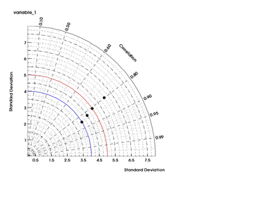

##  Changing VCDAT Lite into a Full Version
Goal:  Be able to launch VCDAT Lite and change it to the VCDAT full version. 

By default the VCDAT will open in the Lite Version, with the main window looking like that:

To switch to the full VCDAT version, from the top menu buttons choose:  
  
"Preferences-->Change to VCDAT Full"   

